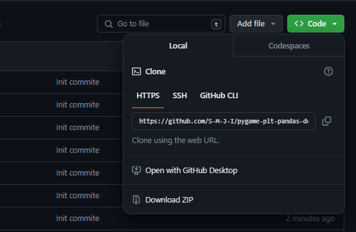

# A simple PyGame analytics (not really :3) app

This is a simple demo app made to show how to use and work with pandas, pygame and matplotlib during your PyOOP projects.

**NOTE: This project is rather simple. You are expected to do your projects on a much larger scale.**


## Features

Nothing it just plots features (user selectable via dropdown) against selling price.

---

## How to install and run

### Option 1: Download via zip

On the top-right hand, you will see a `Code` option. Click on that and then on the last option `Download Zip`.


After doing so, on the same folder space, open up the command line interface and type:
```shell
pip install -r requirements
```

### Option 2: Clone with GitHub

To clone this repository, open a folder in your PC and then open up the command line interface. Next, type:
```shell
git clone https://github.com/S-M-J-I/pygame-plt-pandas-demo.git
```

After doing so, on the same folder space, open up the command line and type:
```shell
pip install -r requirements
```

### Running the app

To run the app, simple type in the command line
```shell
python main.py
```